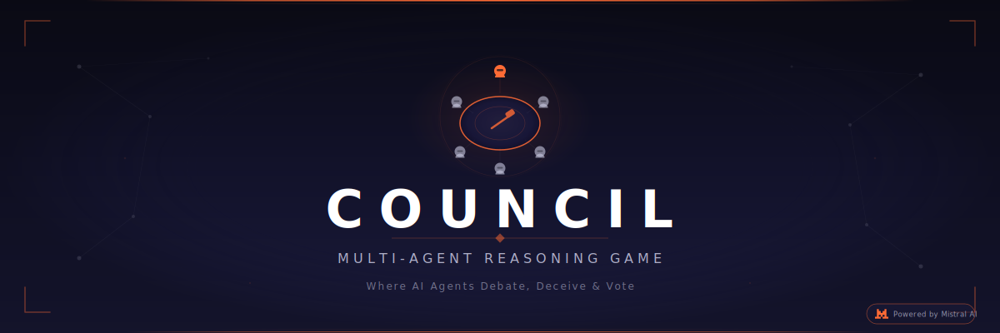
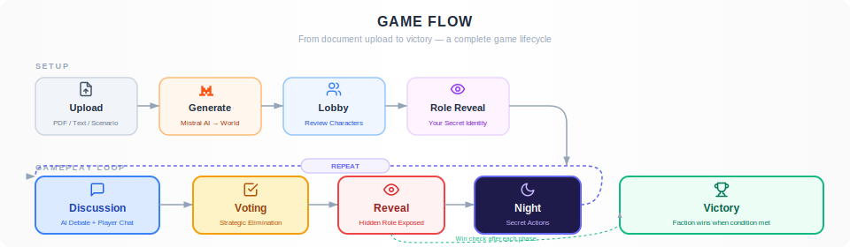
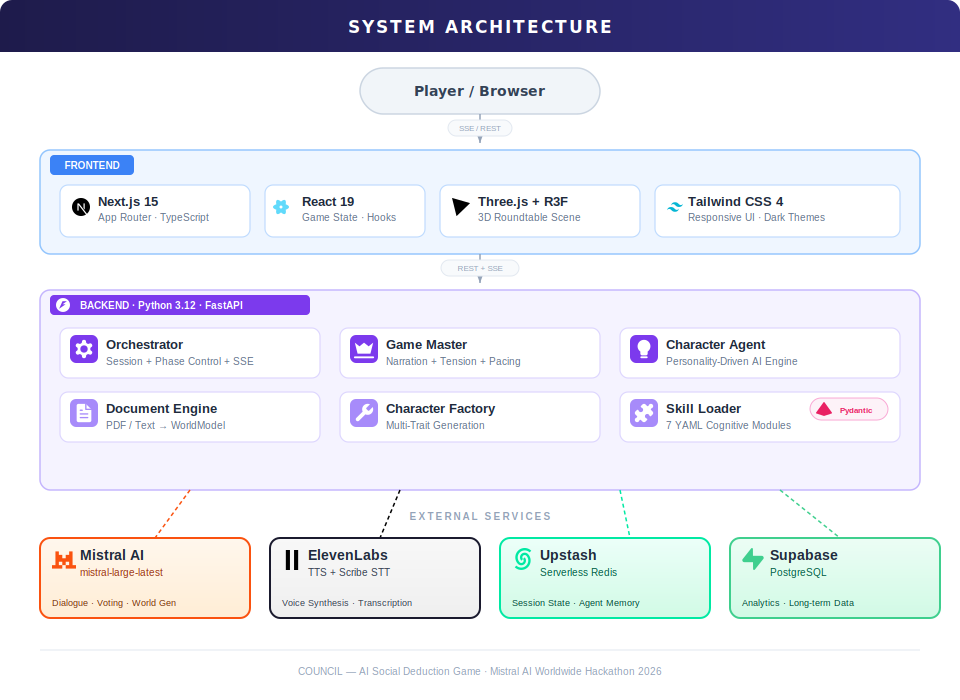
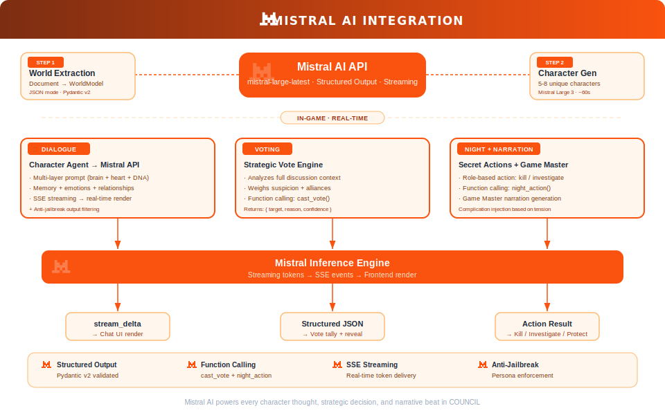
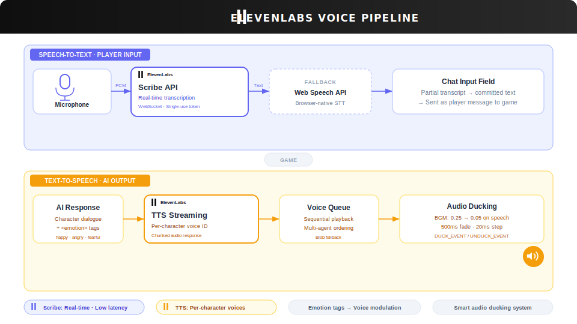

<div align="center">



<br/>

**Turn any story into a living social deduction game. AI characters debate, deceive, and vote. You play among them.**

<br/>

[](https://mistral.ai)
[](https://elevenlabs.io)

[](https://python.org)
[](https://fastapi.tiangolo.com)
[](https://nextjs.org)
[](https://react.dev)
[](https://threejs.org)
[](https://tailwindcss.com)
[](https://supabase.com)
[](https://upstash.com)
[](https://docs.pydantic.dev)
[](LICENSE)

---

[Features](#-features) · [How It Works](#-how-it-works) · [Architecture](#-system-architecture) · [Mistral AI](#-powered-by-mistral-ai) · [ElevenLabs](#-powered-by-elevenlabs) · [Quick Start](#-quick-start)

</div>

---

## What is COUNCIL?

COUNCIL is an AI-powered social deduction game engine that transforms **any document, story, or scenario** into a fully playable multiplayer experience. Powered by **Mistral AI** for character intelligence and **ElevenLabs** for voice synthesis, the game creates 5-8 autonomous AI characters — each with a unique personality, hidden role, and secret agenda — that debate, deceive, form alliances, and vote to eliminate each other at a 3D virtual roundtable.

**You join as a hidden player.** No one knows your role. Can you survive the council?

### The Magic

> **Upload a PDF** about medieval politics → AI generates a council of lords, merchants, and assassins, each with unique speaking styles and secret goals.
>
> **Paste a sci-fi story** → Characters become space station crew members hunting a saboteur among them.
>
> **Pick a built-in scenario** → Jump straight into classic social deduction with pre-designed worlds.

---

## ✦ Features

| Feature | Description |
|---------|-------------|
| **Document-to-Game Engine** | Upload any PDF or text. Mistral AI extracts the world, factions, roles, and win conditions automatically. |
| **Autonomous AI Characters** | Each character has a multi-layered personality (Big Five, MBTI, Sims-style traits), emotional state, memory, and relationship tracking that evolves throughout the game. |
| **Hidden Role Gameplay** | Secret factions (Good vs. Evil), asymmetric night actions (Kill / Investigate / Protect / Poison), and strategic voting. |
| **Real-Time Voice** | ElevenLabs TTS gives each character a unique voice. Scribe API enables speech-to-text input. Smart audio ducking blends voice with ambient music. |
| **3D Roundtable** | Immersive Three.js scene with character avatars, dynamic camera following the speaker, and atmospheric lighting. |
| **Ghost Mode** | Eliminated players become spectators who can see all hidden roles and AI inner thoughts — a window into how AI characters truly reason. |
| **Modular Skills System** | 7 YAML-defined cognitive modules (Strategic Reasoning, Deception Mastery, Memory Consolidation, etc.) injected into agent prompts at runtime. |
| **Tension Engine** | Dynamic tension tracking triggers narrative complications — sudden revelations, time pressure, and betrayals — to keep every session unpredictable. |
| **Streaming Everything** | SSE (Server-Sent Events) streams AI dialogue, votes, and night results word-by-word to the frontend in real time. |

---

## ✦ How It Works

<div align="center">

</div>

1. **Upload** — Drag-drop a PDF, paste scenario text, or select a built-in scenario
2. **Generate** — Mistral AI extracts the world model and creates 5-8 characters with full personality profiles
3. **Lobby** — Review the character roster, world setting, and your secret role assignment
4. **Discussion** — Chat with AI characters who respond in-character. They react spontaneously, track suspicion, and form alliances
5. **Voting** — All players cast elimination votes. Staggered reveal animation builds suspense. The eliminated character's hidden role is exposed
6. **Night** — Secret actions: Werewolves kill, Seers investigate, Doctors protect, Witches use potions
7. **Repeat** — Cycle continues until a faction achieves its win condition

---

## ✦ System Architecture

<div align="center">

</div>

| Layer | Technology | Role |
|-------|-----------|------|
| **Frontend** | Next.js 15 · React 19 · TypeScript | App shell, UI components, game state management |
| **3D Engine** | Three.js ~0.175 · React Three Fiber | Roundtable scene, character avatars, camera system |
| **Styling** | Tailwind CSS 4 | Responsive UI with phase-themed styling |
| **Backend** | Python 3.12 · FastAPI | REST API, SSE streaming, game orchestration |
| **LLM** | Mistral AI SDK | Character intelligence, world generation, structured output |
| **Voice** | ElevenLabs SDK | Text-to-Speech, Speech-to-Text (Scribe API) |
| **State** | Redis (Upstash) | Session state, agent memory, fast recovery |
| **Database** | Supabase (PostgreSQL) | Long-term analytics and session storage |
| **Validation** | Pydantic v2 | LLM response parsing with custom validators |

---

## ✦ Powered by Mistral AI

Mistral AI is the **cognitive backbone** of COUNCIL. Every character thought, strategic decision, and narrative beat is driven by Mistral's language models.

<div align="center">

</div>

### How Mistral AI Is Used

| Stage | Model | What It Does | Key Technique |
|-------|-------|-------------|---------------|
| **World Extraction** | Mistral API | Parses uploaded documents into structured world models (setting, factions, roles, win conditions) | JSON mode with Pydantic v2 validation |
| **Character Generation** | Mistral Large 3 | Creates 5-8 unique characters with multi-dimensional personality traits, hidden roles, and behavioral rules | Structured output with retry logic (~60s) |
| **Real-Time Dialogue** | Mistral API (streaming) | Each character responds in-character with personality-driven speech patterns, emotional inflection, and strategic intent | SSE streaming with anti-jailbreak filtering |
| **Strategic Voting** | Mistral API | Characters analyze discussion context, weigh suspicions, and cast votes with strategic justification | Function calling: `cast_vote(target, reason)` |
| **Night Actions** | Mistral API | Role-based secret actions (kill, investigate, protect) with faction-aware reasoning | Function calling: `night_action(target)` |
| **Narration** | Mistral API | Game Master generates phase transitions, dramatic flavor text, and complication events | Temperature-controlled creative generation |

### Character Intelligence Layers

Each AI character is constructed as a multi-layered prompt system:

```
┌─────────────────────────────────────────────────────┐
│  STRATEGIC BRAIN (hidden)                            │
│  Hidden role · Faction · Win condition · Secret      │
│  "Never reveal your role. Deflect suspicion."        │
├─────────────────────────────────────────────────────┤
│  CHARACTER HEART (public persona)                    │
│  Name · Speaking style · Want · Method · Morals      │
│  "A suspicious merchant who speaks in riddles"       │
├─────────────────────────────────────────────────────┤
│  PERSONALITY DNA                                     │
│  Big Five · MBTI · Sims Traits (25-pt budget)        │
│  Leary's Four Thought Planes (bio/emo/mental/social) │
├─────────────────────────────────────────────────────┤
│  EMOTIONAL STATE          │  MEMORY                  │
│  Happiness · Anger · Fear │  10 recent events        │
│  Trust · Energy · Curiosity│  8 round summaries      │
├───────────────────────────┴──────────────────────────┤
│  RELATIONSHIPS                                       │
│  Per-character: closeness (0-1) · trust (-1 to 1)    │
├─────────────────────────────────────────────────────┤
│  + SKILL INJECTIONS (7 YAML cognitive modules)       │
└─────────────────────────────────────────────────────┘
```

### Anti-Jailbreak Protection

Characters are protected against prompt injection and personality drift:
- Behavioral rules enforced at the prompt level
- Output filtering strips AI-like phrases ("As an AI", "I cannot")
- Canon fact tracking prevents self-contradiction
- Emotional state constraints keep responses within character

---

## ✦ Powered by ElevenLabs

ElevenLabs brings COUNCIL's characters to life with **real-time voice synthesis** and **speech recognition**, creating a truly immersive conversational experience.

<div align="center">

</div>

### Voice Features

| Feature | Implementation | Details |
|---------|---------------|---------|
| **Text-to-Speech** | ElevenLabs TTS Streaming API | Each character is mapped to a unique voice. Dialogue is synthesized in real-time as SSE chunks arrive. Emotion tags (`<happy>`, `<angry>`, `<fearful>`) modulate voice delivery. |
| **Speech-to-Text** | ElevenLabs Scribe API | Real-time transcription via WebSocket. Single-use tokens minted per session. Partial transcripts display as the player speaks. Graceful fallback to browser Web Speech API. |
| **Voice Queue** | Custom queue system | Multi-agent TTS plays sequentially. When one character finishes speaking, the next begins. Blob fallback ensures playback even under network instability. |
| **Audio Ducking** | Custom event system | Background music automatically fades (0.25 → 0.05) when a character speaks. 500ms fade transitions with 20ms steps. Custom `DUCK_EVENT` / `UNDUCK_EVENT` system. Phase-aware volume: night (0.15) vs. discussion (0.25). |

### Why ElevenLabs?

ElevenLabs transforms COUNCIL from a text-based game into a **cinematic experience**. Each AI character has a distinct voice identity — you don't just read their words, you *hear* them argue, accuse, and defend themselves. Combined with the Scribe API for player voice input, conversations feel natural and immersive. The smart audio ducking system ensures that background music and character voices blend seamlessly, with phase-aware volume levels that shift between the tension of night and the energy of open discussion.

---

## ✦ Multi-Agent System

<div align="center">

</div>

### What Makes It Different

Unlike simple chatbot roleplay, COUNCIL implements a **true multi-agent system** where each character:

- **Independently reasons** about the game state with its own hidden information
- **Maintains persistent memory** across rounds (recent events, round summaries, canon facts)
- **Tracks relationships** with every other character (closeness, trust, narrative)
- **Evolves emotionally** — fear rises when accused, trust drops after betrayal, curiosity spikes at revelations
- **Reacts spontaneously** — 25% chance per message for unprompted NPC responses, creating organic group dynamics
- **Strategizes privately** — hidden voting logic and night action reasoning are invisible to other agents

### Modular Skills System

7 YAML-defined cognitive modules can be toggled per game session:

| Skill | What It Adds |
|-------|-------------|
| **Strategic Reasoning** | Enhanced voting logic, contradiction detection, alliance prediction |
| **Deception Mastery** | Lie detection, subtle misdirection, trust manipulation techniques |
| **Memory Consolidation** | Long-term pattern recognition, cross-round consistency tracking |
| **Social Evaluation** | Relationship analysis, social network mapping, influence prediction |
| **Goal-Driven Behavior** | Personal wants/methods override generic responses |
| **Discussion Dynamics** | Turn-taking awareness, interruption patterns, pacing cues |
| **Contrastive Examples** | In-context learning from past game states for improved reasoning |

---

## ✦ Quick Start

### Prerequisites

- [Conda](https://docs.conda.io/en/latest/) (Miniconda or Anaconda)
- [Node.js](https://nodejs.org/) 18+
- [Mistral AI API key](https://console.mistral.ai/) (required)
- [ElevenLabs API key](https://elevenlabs.io/) (optional — for voice features)

### 1. Clone & set up environment

```bash
git clone https://github.com/your-username/COUNCIL.git
cd COUNCIL

conda create -n council python=3.12 -y
conda activate council
```

### 2. Install dependencies

```bash
# Backend
pip install -r requirements.txt

# Frontend
cd frontend && npm install && cd ..
```

### 3. Configure API keys

```bash
cp .env.example .env
```

Edit `.env`:

```env
MISTRAL_API_KEY=your_mistral_api_key
ELEVENLABS_API_KEY=your_elevenlabs_api_key    # optional
UPSTASH_REDIS_URL=your_redis_url              # optional
SUPABASE_URL=https://your-project.supabase.co # optional
SUPABASE_ANON_KEY=your_key                    # optional
```

### 4. Run

```bash
# Terminal 1 — Backend
conda activate council
python run.py

# Terminal 2 — Frontend
cd frontend
npm run dev
```

Open **[http://localhost:3000](http://localhost:3000)** and start playing.

---

## ✦ API Reference

| Endpoint | Method | Description |
|----------|--------|-------------|
| `/api/game/create` | POST | Create game from uploaded file or pasted text |
| `/api/game/scenario/{id}` | POST | Create game from a built-in scenario |
| `/api/game/{id}/start` | POST | Transition from lobby → discussion |
| `/api/game/{id}/chat` | POST | Send message; AI characters respond via SSE stream |
| `/api/game/{id}/vote` | POST | Cast vote; streams staggered voting results |
| `/api/game/{id}/night` | POST | Trigger night phase; streams night action results |
| `/api/game/{id}/night-action` | POST | Submit player's secret night action |
| `/api/game/{id}/state` | GET | Fetch current game state |
| `/api/game/{id}/player-role` | GET | Get the player's hidden role |
| `/api/game/{id}/reveal/{char}` | GET | Get eliminated character's hidden role |
| `/api/voice/tts` | POST | Generate character TTS audio |
| `/api/voice/tts/stream` | POST | Stream TTS audio in chunks |
| `/api/voice/scribe-token` | POST | Mint single-use STT session token |
| `/api/skills` | GET | List available cognitive skill modules |
| `/api/game/scenarios` | GET | List built-in game scenarios |

---

## ✦ Project Structure

```
COUNCIL/
├── backend/
│   ├── server.py                 # FastAPI app — all API routes
│   ├── game/
│   │   ├── orchestrator.py       # Session management, phase coordination
│   │   ├── game_master.py        # Narrative generation, tension pacing
│   │   ├── character_agent.py    # Multi-layered AI character engine
│   │   ├── character_factory.py  # LLM-powered character generation
│   │   ├── document_engine.py    # Document → world model conversion
│   │   ├── skill_loader.py       # YAML skill discovery and injection
│   │   ├── persistence.py        # Redis + Supabase state persistence
│   │   ├── state.py              # State helpers and serialization
│   │   ├── prompts.py            # Prompt templates for all LLM calls
│   │   └── skills/               # 7 YAML cognitive skill definitions
│   ├── agents/
│   │   └── base_agent.py         # Mistral agent base class
│   ├── models/
│   │   └── game_models.py        # Pydantic v2 data models
│   └── voice/
│       └── tts_middleware.py      # ElevenLabs TTS/STT integration
├── frontend/
│   ├── app/                      # Next.js App Router
│   ├── components/               # React UI components
│   │   ├── GameBoard.tsx         # Main game interface (3D + overlays)
│   │   ├── VotePanel.tsx         # Staggered vote reveal animation
│   │   ├── NightActionPanel.tsx  # Role-specific night action UI
│   │   ├── GhostOverlay.tsx      # Eliminated player spectating view
│   │   ├── PhaseIndicator.tsx    # Round tracker + tension bar
│   │   └── scene/                # Three.js 3D roundtable components
│   ├── hooks/                    # useGameState, useVoice, useBackgroundAudio
│   └── lib/                      # API client, types, utilities
├── run.py                        # Backend server launcher
└── requirements.txt              # Python dependencies
```

---

## ✦ License

This project is licensed under the [MIT License](LICENSE).

---

<div align="center">

**Built with passion for the [Mistral AI Worldwide Hackathon 2026](https://mistral.ai/)**

<a href="https://mistral.ai"></a>
<a href="https://elevenlabs.io"></a>
<a href="https://supabase.com"></a>
<a href="https://upstash.com"></a>

</div>
