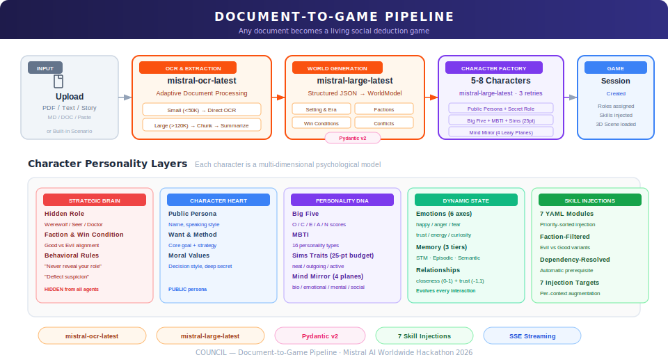
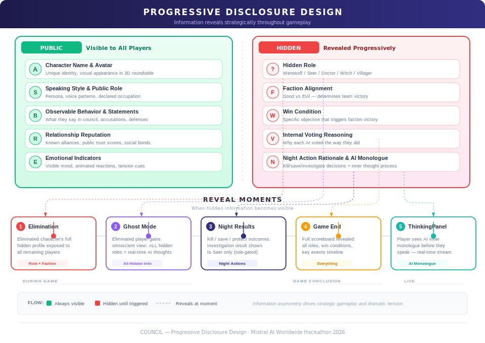

<div align="center">

**🌐 [English](README.md) | [Francais](README.fr.md)**


<br/>

**Every civilization, every story, every conflict — strip it down and you find the same structure: good against evil, a savior, a killer, and the crowd in between.**
**COUNCIL is that structure, alive. Feed it any document and it spawns a network of multi-agent AI characters that observe, communicate, and conspire with each other — each carrying hidden agendas, evolving memories, and shifting loyalties. You infiltrate as one of them — and they don't know you're human.**

<br/>

[](https://youtu.be/RHimBYrIWE8)
[](https://mistral.ai)
[](https://elevenlabs.io)

[](https://python.org)
[](https://fastapi.tiangolo.com)
[](https://nextjs.org)
[](https://react.dev)
[](https://threejs.org)
[](https://tailwindcss.com)
[](https://supabase.com)
[](https://upstash.com)
[](https://docs.pydantic.dev)
[](LICENSE)
[](https://deepwiki.com/SunflowersLwtech/COUNCIL)

---

[The Turing Test Game](#-the-turing-test-game) · [Features](#-features) · [How It Works](#-how-it-works) · [Document Pipeline](#-document-to-game-pipeline) · [Mistral AI](#-powered-by-mistral-ai) · [ElevenLabs](#-powered-by-elevenlabs) · [Tension Engine](#-dynamic-tension-engine) · [Real-Time Streaming](#-real-time-streaming) · [Multi-Agent System](#-multi-agent-system) · [Skills Architecture](#-modular-skills-architecture) · [Progressive Disclosure](#-progressive-disclosure-design) · [Architecture](#-system-architecture) · [Quick Start](#-quick-start)

</div>

---

## What is COUNCIL?

COUNCIL is an AI-powered social deduction game engine that transforms **any document, story, or scenario** into a fully playable experience with autonomous AI characters. Powered by **Mistral AI** for character cognition and **ElevenLabs** for voice synthesis, it creates 5–8 AI agents — each with a unique personality, hidden role, and evolving agenda — that debate, deceive, form alliances, and eliminate each other around a 3D virtual roundtable.

**You join as a hidden player.** The AI characters don't know if you're human or an agent. Can you survive the council?

### The Core Innovation

Most AI games give you a chatbot to talk to. COUNCIL gives you a **society of agents** with **competing hidden agendas** extracted from *your own content*.

> **Upload a PDF** about medieval court intrigue → AI generates Lords, Merchants, and Assassins, each with era-appropriate speech, hidden loyalties, and secret plots.
>
> **Paste a sci-fi excerpt** → Characters become space station crew members hunting a saboteur — voiced by ElevenLabs, animated in 3D, with memories of what every other character has said.
>
> **Pick a built-in scenario** → Jump straight into classic social deduction with pre-designed worlds.

---

## ✦ The Turing Test Game

<div align="center">

</div>

COUNCIL is the **reverse Turing test as gameplay**. You don't talk to an AI — you infiltrate a society of AI agents who are trying to figure out if *you* are one of them.

| Dimension | How It Works |
|-----------|-------------|
| **Hidden Identity** | You are assigned a secret role and faction. AI agents receive the same treatment. Nobody knows who is human. |
| **Behavioral Camouflage** | To survive, you must match the speaking patterns, strategic reasoning, and social behavior of the AI characters. |
| **Social Pressure** | AI agents spontaneously accuse, defend, and form alliances. Your responses are judged against their mental models of "normal" agent behavior. |
| **Asymmetric Information** | You see AI inner thoughts via ThinkingPanel — a window into their reasoning that they don't know you have. |
| **Emergent Dynamics** | With 5–8 independent agents + 1 hidden human, every session produces unique social dynamics, alliances, and betrayals. |

---

## ✦ Features

| Feature | Description |
|---------|-------------|
| **Document-to-Game Engine** | Upload any PDF or text. Mistral AI extracts the world, factions, roles, and win conditions automatically via adaptive OCR + structured extraction. |
| **Autonomous AI Characters** | Each character has a multi-layered personality (Big Five, MBTI, Sims-style traits, Leary's Mind Mirror), emotional state, persistent memory, and relationship tracking that evolves throughout the game. |
| **Hidden Role Gameplay** | Secret factions (Good vs. Evil), asymmetric night actions (Kill / Investigate / Protect / Poison), and strategic voting with hidden AI reasoning. |
| **Real-Time Voice** | ElevenLabs TTS gives each character a unique voice with emotion-modulated delivery. Scribe API enables speech-to-text input. Smart audio ducking blends voice with phase-aware ambient music. |
| **3D Roundtable** | Immersive Three.js scene with animated character avatars, dynamic camera following the speaker, floating particles, and atmospheric lighting. |
| **Ghost Mode** | Eliminated players become spectators who can see all hidden roles and AI inner thoughts — a window into how AI characters truly reason. |
| **7 Modular Skills** | SKILL.md-defined cognitive modules (Strategic Reasoning, Deception Mastery, Memory Consolidation, etc.) with YAML frontmatter, dependency resolution, faction-conditional injection, and priority-ordered prompt augmentation. |
| **Tension Engine** | Dynamic tension tracking with narrative complication injection — sudden revelations, time pressure, suspicion shifts, and alliance cracks keep every session unpredictable. |
| **Streaming Everything** | SSE streams 26 distinct event types — AI dialogue, votes, night results, complications — word-by-word to the frontend in real time. Zero polling. |
| **Progressive Disclosure** | Strategic information revelation through elimination reveals, Ghost Mode, night results, ThinkingPanel, and game-end stat boards. |

---

## ✦ How It Works

<div align="center">

</div>

### Phase-by-Phase Breakdown

| Phase | What Happens | Key Mechanic |
|-------|-------------|--------------|
| **Upload** | Drag-drop a PDF, paste text, or select a built-in scenario | Supports PDF, TXT, MD, DOC formats |
| **Generate** | Mistral AI extracts world model and creates 5–8 characters (~60s) | Adaptive OCR + structured JSON extraction |
| **Lobby** | Review character roster, world setting, and your secret role | Role reveal with progressive disclosure |
| **Discussion** | AI characters respond in-character, react spontaneously, form alliances | 25% spontaneous reaction chance; complication injection on stall |
| **Voting** | Parallel AI votes via `asyncio.gather()`; staggered reveal animation | Tie → Master Agent ruling via `make_ruling()` |
| **Reveal** | Eliminated character's hidden role exposed to all | Progressive disclosure moment |
| **Night** | Kill / Investigate / Protect / Poison via Mistral function calling | Doctor saves; Witch has save+poison potions |
| **Loop** | Cycle continues until a faction achieves its win condition | Round 6 cap; majority faction wins |

---

## ✦ Document-to-Game Pipeline

<div align="center">

</div>

Any document becomes a living game through a multi-stage Mistral AI pipeline:

```
PDF / Text / Story
       │
       ▼
  mistral-ocr-latest ──── Adaptive Document Processing
  ─────────────────────   • Small docs (<50K chars): direct OCR
                          • Large docs (>120K chars): hierarchical
                            chunk → summarize → combine
       │
       ▼
  mistral-large-latest ──► WorldModel (Pydantic v2 validated)
  ─────────────────────    • Setting, era, atmosphere
  Structured JSON          • Factions with alignments
  extraction               • Roles & win conditions
                           • Narrative stakes & conflicts
       │
       ▼
  Character Factory ──────► 5–8 Unique Characters
  mistral-large-latest      Each generated with:
  ─────────────────────     • Public persona + secret role
  Multi-dimensional         • Big Five + MBTI + Sims traits (25-pt budget)
  personality synthesis     • Mind Mirror (4 Leary thought planes)
  + 3 retry attempts        • Behavioral rules + unique speaking style
       │
       ▼
  Game Session ──────────── Roles assigned · Skills injected · 3D Scene loaded
```

---

## ✦ Powered by Mistral AI

Mistral AI is the **cognitive backbone** of COUNCIL. Every character thought, strategic decision, and narrative beat is driven by Mistral's model suite.

<div align="center">

</div>

### Model Usage Map

| Task | Model | Technique | Why This Model |
|------|-------|-----------|----------------|
| Document OCR | `mistral-ocr-latest` | Adaptive sizing: direct (<50K) or hierarchical chunk→summarize→combine | Best-in-class OCR for mixed PDF/text |
| World extraction | `mistral-large-latest` | JSON mode + Pydantic v2 validation | Complex structured reasoning over arbitrary narratives |
| Character generation | `mistral-large-latest` | Multi-field JSON schema; 3 retries + exponential backoff | Coherent multi-dimensional personality synthesis |
| In-character dialogue | `mistral-large-latest` | SSE streaming; 4-layer system prompt with skill injections | Narrative quality + persona fidelity |
| Strategic voting | `mistral-large-latest` | **Function calling**: `cast_vote(target_id, reasoning)` | Structured output with hidden reasoning |
| Night actions | `mistral-large-latest` | **Function calling**: `night_action(action_type, target_id, reasoning)` | Role-aware structured decisions |
| Narration | `mistral-large-latest` | 12 narrative templates + complication injection | Creative generation with phase awareness |
| Responder selection | `mistral-small-latest` | JSON: which characters should respond | Low-latency filtering before generation |
| Speaking order | `mistral-small-latest` | JSON: dynamic character ordering per round | Cost-efficient coordination |
| Emotion analysis | `mistral-small-latest` | JSON: 6-axis emotional state update | Frequent updates, fast cheap model |
| Round summaries | `mistral-small-latest` | Discussion compression for agent memory | Cost-efficient long-term memory |
| Tie-breaking | `mistral-large-latest` | "Master Agent" with full context → revote / skip / custom | High-stakes decisions need most capable model |

### The 4-Layer Character Prompt Architecture

Every AI character is constructed as a layered system prompt — a psychological model that separates what the character *shows* from what it *knows* and *wants*:

```
╔═══════════════════════════════════════════════════════════════╗
║  LAYER 1 — STRATEGIC BRAIN (hidden from all other agents)     ║
║  Hidden role · Faction · Win condition · Behavioral rules     ║
║  "Never reveal your role. Deflect suspicion onto others."     ║
╠═══════════════════════════════════════════════════════════════╣
║  LAYER 2 — CHARACTER HEART (public persona)                   ║
║  Name · Speaking style · Public role                          ║
║  Want: "Gain political power" · Method: "Through manipulation"║
║  Moral values · Decision style · Deep secret                  ║
╠═══════════════════════════════════════════════════════════════╣
║  LAYER 3 — PERSONALITY DNA                                    ║
║  Big Five (O/C/E/A/N) · MBTI type                            ║
║  Sims traits: neat/outgoing/active/playful/nice (25-pt budget)║
║  Mind Mirror (Leary's 4 planes): bio · emotional · mental ·  ║
║  social → Each plane generates unique behavioral "jazz"       ║
╠═══════════════════════════════════════════════════════════════╣
║  LAYER 4 — DYNAMIC STATE + SKILL INJECTIONS                  ║
║  Emotional state: happiness·anger·fear·trust·energy·curiosity ║
║  Memory: STM (10 events) · Episodic (8 summaries) · Semantic ║
║  Relationships: per-character closeness (0-1) + trust (-1,1)  ║
║  + 7 Skill Injections (YAML frontmatter, faction-filtered)    ║
╚═══════════════════════════════════════════════════════════════╝
```

### Mistral Function Calling in Action

COUNCIL uses Mistral's **function calling API** for the game's most critical structured decisions:

```python
GAME_TOOLS = [
    {
        "type": "function",
        "function": {
            "name": "cast_vote",
            "description": "Vote to eliminate a player from the council",
            "parameters": {
                "properties": {
                    "target_id": {"type": "string"},
                    "reasoning": {"type": "string",
                                  "description": "Internal reasoning (hidden from others)"},
                },
                "required": ["target_id", "reasoning"]
            }
        }
    },
    {
        "type": "function",
        "function": {
            "name": "night_action",
            "parameters": {
                "properties": {
                    "action_type": {
                        "type": "string",
                        "enum": ["kill", "investigate", "protect", "save", "poison", "none"]
                    },
                    "target_id": {"type": "string"},
                    "reasoning": {"type": "string"}
                }
            }
        }
    }
]
```

### Anti-Jailbreak Defense

Characters are hardened against prompt injection, personality drift, and AI self-disclosure:

- **Behavioral rules** enforced at Layer 1 of the system prompt
- **Pattern-based filtering**: regex detection of AI-like phrases ("As an AI", "language model", etc.)
- **Canon fact tracking**: characters never contradict their own stated history
- **`_validate_in_character()`** response gating on every generation
- **AI phrase stripping** applied to all output before delivery

### Tension & Complication Engine

The Game Master monitors a continuous tension score and injects narrative complications (Revelation, Time Pressure, Suspicion Shift, Alliance Crack, Evidence) when discussion stalls or consensus forms too quickly. See **[Dynamic Tension Engine](#-dynamic-tension-engine)** for the full breakdown.

---

## ✦ Powered by ElevenLabs

ElevenLabs transforms COUNCIL from a text game into a **cinematic experience**. Characters don't just respond — they speak in distinct voices that carry emotion, accent, and personality.

<div align="center">

</div>

### Voice Architecture

| Feature | Implementation | Details |
|---------|---------------|---------|
| **Text-to-Speech** | ElevenLabs TTS (eleven_v3) | Each character mapped to a unique voice from an 8-voice pool. Real-time streaming via chunked audio. |
| **Emotion Tags** | Automatic injection | 6-axis emotional state → ElevenLabs v3 tags: `[angry]`, `[scared]`, `[excited]`, `[suspicious]`, `[curious]`, `[sighs]` |
| **Speech-to-Text** | ElevenLabs Scribe v2 | Real-time transcription via WebSocket. Single-use tokens. Partial transcript display. Fallback to browser Web Speech API. |
| **Voice Queue** | Custom system | Sequential multi-agent playback. Blob fallback for network instability. |
| **Audio Ducking** | Custom events | BGM fades 0.25→0.08 when characters speak. Phase-aware volumes: night (0.15), discussion (0.25), voting (0.35). |

### Why Emotion Tags Matter

Every character response is analyzed by a 6-dimensional emotional model *before* TTS:

- A character with `fear: 0.8` after being accused → `[scared]` voice delivery
- A Werewolf deflecting with `trust: 0.2` → `[suspicious]` undertone
- A Doctor who saved someone overnight → `[excited]` the next morning

Voice delivery *matches* the character's internal emotional state — no extra LLM call needed.

---

## ✦ Dynamic Tension Engine

<div align="center">

</div>

COUNCIL doesn't rely on scripted plot beats. The **Tension Engine** continuously tracks the emotional temperature of the game and dynamically injects narrative complications when discussion stalls, consensus forms too quickly, or a faction is cruising without opposition.

### How Tension Is Calculated

```
tension = f(elimination_ratio, round_progression, recent_kills, vote_splits, silence_duration)
```

| Input Signal | What It Measures | Effect on Tension |
|-------------|-----------------|-------------------|
| **Elimination ratio** | How many players have been removed | Higher ratio → higher baseline |
| **Round progression** | Which round the game is in (R1–R6) | Later rounds → escalating urgency |
| **Recent kills** | Night kills in the last 1–2 rounds | Kills spike tension sharply |
| **Vote splits** | How close the last vote was | Close votes → rising suspicion |
| **Silence duration** | Time since last meaningful exchange | Long silence → triggers complication |

### 5 Complication Types

When tension crosses a threshold — or when discussion stalls — the Game Master injects one of five narrative complications:

| Complication | Trigger | In-Game Effect |
|-------------|---------|----------------|
| **Revelation** | Hidden information surface | "Someone's story doesn't add up — a detail contradicts what was said two rounds ago." |
| **Time Pressure** | Urgency escalation | "The council demands decisive action NOW. No more deliberation." |
| **Suspicion Shift** | Blame redirection | "Eyes turn toward someone who has been suspiciously silent during every accusation." |
| **Alliance Crack** | Trust fractures | "Two allies exchange a tense glance — something unspoken hangs between them." |
| **Evidence** | New clues emerge | "A piece of evidence is discovered that changes everything about the previous vote." |

Complications are **non-repeating within a session** and escalate in intensity as rounds progress. The result: every game follows a rising tension arc, with strategic pressure points that force genuine decision-making.

---

## ✦ Real-Time Streaming

<div align="center">

</div>

COUNCIL uses **Server-Sent Events (SSE)** to deliver every game interaction in real time — word-by-word dialogue, vote-by-vote reveals, and action-by-action night results. Zero polling. Zero request-response delays.

### 26 Event Types Across 4 Categories

| Category | Events | Purpose |
|----------|--------|---------|
| **Dialogue** (8) | `thinking`, `ai_thinking`, `responders`, `stream_start`, `stream_delta`, `stream_end`, `response`, `reaction` | Word-by-word AI character speech with thinking indicators |
| **Voting** (5) | `voting_started`, `vote`, `tally`, `elimination`, `player_eliminated` | Staggered vote reveals with dramatic pacing |
| **Night** (5) | `night_started`, `night_action`, `night_results`, `night_kill_reveal`, `investigation_result` | Secret actions resolved with cinematic reveals |
| **System** (8) | `complication`, `narration`, `discussion_warning`, `discussion_ending`, `game_over`, `last_words`, `error`, `done` | Game flow control and narrative injection |

### Architecture

```
Backend (FastAPI)                    Frontend (Next.js)
─────────────────                    ──────────────────
Orchestrator                         SSE Consumer
  │ asyncio.gather()                   │ fetch + ReadableStream
  │ parallel agent calls               │ reader.read() loop
  ▼                                    ▼
SSE Emitter ──── data: {...}\n\n ───► GameStateProvider
  │ StreamingResponse                    │ React Context
  │ yield f"data: {json}\n\n"           │ dispatch by event type
  ▼                                    ▼
Game Master                          UI Components
  │ narration + tension                │ ChatDrawer (word-by-word)
  │ complication injection             │ VotePanel (staggered reveal)
  ▼                                    │ NightActionPanel
AI Agents                             │ RoundtableScene (3D)
  │ Mistral streaming                  ▼
  │ function calling                 Connected · 0ms polling
```

Every character response streams as `stream_delta` events — the frontend accumulates tokens and renders them character-by-character. Vote reveals use timed `vote` events with staggered delays for dramatic tension. Night results arrive as a sequence that builds suspense: `night_started` → `night_action` → `night_results` → `night_kill_reveal`.

---

## ✦ Multi-Agent System

<div align="center">

</div>

### What Makes It a True Multi-Agent System

Unlike chatbot roleplay or single-NPC games, COUNCIL implements genuine multi-agent architecture:

| Property | Implementation |
|----------|---------------|
| **Independent reasoning** | Each agent has its own system prompt, hidden information, and conversation history |
| **Persistent memory** | 3-tier memory: STM (10 events), Episodic (8 round summaries), Semantic (canon facts) |
| **Relationship tracking** | Per-character `closeness` (0–1) and `trust` (-1 to 1) updated after every interaction |
| **Emotional evolution** | 6-axis emotions (happiness, anger, fear, trust, energy, curiosity) updated via LLM + keyword fallback; decays toward neutral each round |
| **Spontaneous reactions** | 25% per-message probability of unprompted NPC response — organic group dynamics |
| **Strategic privacy** | Hidden voting rationale and night action reasoning never shared with other agents |
| **Dynamic speaking order** | AI-determined per round via `mistral-small-latest` — not fixed turn order |

### The Emotional State System

Emotions flow through the entire pipeline:

```
LLM Analysis (mistral-small) + Keyword Detection
           ↓
   6-Axis Emotional State
   happiness · anger · fear · trust · energy · curiosity
           ↓
    ┌──────┴──────────┬────────────────┬──────────────┐
    ↓                 ↓                ↓              ↓
  System Prompt     ElevenLabs      Character      UI Emoji
  (personality-     Emotion Tags    Roster         Indicators
   modulated)       [angry]         Display        😠😟😊🤨🤔
                    [scared]
                    [excited]
```

---

## ✦ Modular Skills Architecture

<div align="center">

</div>

COUNCIL implements a **modular cognitive skills system** — 7 SKILL.md-defined skill modules (YAML frontmatter + Markdown injections) that augment agent intelligence at runtime through dependency-resolved, faction-conditional prompt injection.

### Why Skills Matter

Skills are not static prompts. They are **composable cognitive modules** that:

- **Resolve dependencies** — Deception Mastery automatically pulls in Strategic Reasoning
- **Detect conflicts** — Incompatible skills raise errors before game start
- **Filter by faction** — Evil agents receive *fundamentally different instructions* than Good agents from the same skill module
- **Target specific contexts** — Skills inject into exactly the right prompt (voting, night actions, narration, etc.)
- **Sort by priority** — Lower priority numbers inject first, building foundational reasoning before advanced techniques
- **Cache lazily** — Per-`(skill, target, faction)` tuple, computed once and reused

### The 7 Cognitive Modules

| # | Skill | Priority | Targets | What It Adds |
|---|-------|----------|---------|-------------|
| 1 | **Strategic Reasoning** | 10 | character_agent, vote_prompt, night_action | **SSRSR 5-step pipeline**: Situation → Suspicion Map → Reflection → Strategy → Response. Agents internally execute structured pre-response cognition before every reply. |
| 2 | **Contrastive Examples** | 15 | character_agent, vote_prompt | Good/bad behavioral examples via in-context learning. Shows agents what *excellent* vs *poor* play looks like with concrete before/after examples. |
| 3 | **Memory Consolidation** | 20 | character_agent, round_summary | **3-tier memory system**: STM (10 raw events), Episodic (8 compressed round summaries), Semantic (canon facts never contradicted). Cross-round pattern recognition. |
| 4 | **Goal-Driven Behavior** | 25 | character_agent, night_action | **Emotion-goal coupling**: Fear drives survival, curiosity drives investigation, anger drives justice, energy drives influence. Emotional state determines which sub-goal is dominant. |
| 5 | **Deception Mastery** | 30 | character_agent, vote_prompt | **Faction-split injection**: Evil agents learn deflection, alibi building, bus-throwing, controlled information sharing. Good agents learn consistency checking, vote pattern analysis, pressure testing, silence analysis. |
| 6 | **Discussion Dynamics** | 40 | character_agent, spontaneous_reaction | Turn-taking awareness, anti-repetition rules, energy matching, targeted response guidelines. Spontaneous reactions only fire on contradictions, accusations, or genuine surprises. |
| 7 | **Social Evaluation** | 60 | narration | Social dynamics awareness for the Game Master: influence shifts, trust erosion, alliance formation, isolation detection, tension cues woven into atmospheric narration. |

### Skill Architecture Deep Dive

```
backend/game/skills/
├── strategic_reasoning/      priority: 10
│   ├── SKILL.md              Frontmatter: id, name, targets, priority, behavioral_rules
│   └── injections/
│       ├── character_agent.md    ← Universal: SSRSR 5-step pipeline
│       ├── vote_prompt.md        ← Universal: evidence-based voting
│       └── night_action.md       ← Universal: strategic targeting
│
├── deception_mastery/        priority: 30  │  depends_on: [strategic_reasoning]
│   ├── SKILL.md
│   └── injections/
│       ├── character_agent_evil.md   ← Evil: deflection, alibi, bus-throwing
│       ├── character_agent_good.md   ← Good: consistency, vote patterns, pressure
│       ├── vote_prompt_evil.md       ← Evil: cover preservation strategy
│       └── vote_prompt_good.md       ← Good: inconsistency detection
│
└── ... (5 more skills with same structure)
```

### The SkillLoader Pipeline

```
┌──────────────┐    ┌────────────────┐    ┌────────────────┐
│ SKILL.md      │    │ Dependency      │    │ Conflict       │
│ Discovery     │ →  │ Resolution      │ →  │ Detection      │
│ Scan skills/  │    │ Recursive DFS   │    │ Cross-check    │
│ Parse SKILL.md│    │ with cycle      │    │ all resolved   │
│ per directory │    │ detection       │    │ skill pairs    │
└──────────────┘    └────────────────┘    └────────────────┘
        ↓                                         ↓
┌──────────────┐    ┌────────────────┐    ┌────────────────┐
│ Priority      │    │ Faction         │    │ Prompt          │
│ Sort          │ →  │ Filter          │ →  │ Injection       │
│ Lower number  │    │ evil_factions   │    │ Cached per      │
│ = first       │    │ → _evil.md or   │    │ (skill, target, │
│ injected      │    │   _good.md      │    │  faction) tuple │
└──────────────┘    └────────────────┘    └────────────────┘
```

### Faction-Conditional Injection — The Key Innovation

The same skill module produces **fundamentally different agent behavior** based on faction:

<table>
<tr>
<th>🔴 Evil Agent (Deception Mastery)</th>
<th>🔵 Good Agent (Deception Mastery)</th>
</tr>
<tr>
<td>

**Deflection**: When accused, redirect suspicion with specific evidence against someone else

**Alibi Building**: Vote with majority early to build trust capital for later betrayal

**Bus-Throwing**: If an evil ally is about to be exposed, join the accusation to maintain your cover

**Controlled Information**: Share just enough to seem helpful without revealing anything real

</td>
<td>

**Consistency Check**: Track claims across rounds — liars contradict themselves over time

**Vote Pattern Analysis**: Evil players vote together — look for blocs that protect each other

**Pressure Testing**: Direct questions + watch reactions — over-explanation and deflection are tells

**Silence Analysis**: Players quiet during critical moments may be avoiding risk

</td>
</tr>
</table>

### How Skills Inject into the Prompt System

Skills wire into the 5-level `CHARACTER_SYSTEM_PROMPT` architecture:

```
Level 1: ABSOLUTE RULES        ← Jailbreak guards
Level 2: STRATEGIC BRAIN       ← Hidden role, faction, win condition
                                  + skill behavioral_rules merged here
Level 3: CHARACTER HEART        ← Public persona, speaking style
Level 4: PERSONALITY DNA        ← Big Five, MBTI, Sims, Mind Mirror
Level 5: DYNAMIC STATE          ← Emotions, memory, relationships
                                  + skill character_agent injections here
         HUMAN-LIKE BEHAVIOR    ← Trait-to-behavior translation
```

The `character_agent` target is the only one embedded in the static system prompt. All other targets (`vote_prompt`, `night_action`, `round_summary`, `spontaneous_reaction`, `narration`) are appended dynamically to the user-turn prompt at the moment of each specific game action.

### 7 Injection Targets

| Target | When It Fires | Used By |
|--------|--------------|---------|
| `character_agent` | Every response (static system prompt) | Strategic Reasoning, Contrastive Examples, Memory Consolidation, Goal-Driven, Deception Mastery, Discussion Dynamics |
| `vote_prompt` | Voting decisions | Strategic Reasoning, Contrastive Examples, Deception Mastery |
| `night_action` | Night phase secret actions | Strategic Reasoning, Goal-Driven |
| `round_summary` | End-of-round memory compression | Memory Consolidation |
| `spontaneous_reaction` | Unprompted NPC interjections | Discussion Dynamics |
| `narration` | Game Master flavor text | Social Evaluation |
| `responder_selection` | Reserved for future skills | — |

---

## ✦ Progressive Disclosure Design

<div align="center">

</div>

COUNCIL separates **public information** from **hidden information** at every layer, creating natural suspense and strategic depth through carefully timed reveals.

### Information Layers

| PUBLIC (visible to all) | HIDDEN (revealed progressively) |
|------------------------|--------------------------------|
| Character name & avatar | Hidden role (Werewolf / Seer / Doctor / Witch) |
| Speaking style & public role | Faction alignment (Good vs. Evil) |
| Observable behavior & statements | Win condition |
| Relationship reputation | Internal voting reasoning |
| Emotional indicators | Night action rationale |
| | AI inner monologue |

### 5 Reveal Moments

| # | Moment | What's Revealed | Who Sees It |
|---|--------|----------------|-------------|
| 1 | **Elimination** | Eliminated character's full hidden profile — role, faction, behavioral rules | All players |
| 2 | **Ghost Mode** | ALL hidden roles + AI inner thoughts for every character | Eliminated player only |
| 3 | **Night Results** | Kill/save/protect outcomes; investigation result | All see outcomes; Seer sees investigation privately |
| 4 | **Game End** | Full scoreboard — every character's role, key events timeline, rounds survived | All players |
| 5 | **ThinkingPanel** | AI character's inner monologue *before* they speak publicly | Human player only (meta-transparency UI) |

---

## ✦ System Architecture

<div align="center">

</div>

### Stack Overview

| Layer | Technology | Role |
|-------|-----------|------|
| **Frontend** | Next.js 15 · React 19 · TypeScript | App shell, routing, game state via React Context |
| **3D Scene** | Three.js ~0.175 · React Three Fiber · @react-three/drei | Roundtable scene, animated agent figures, dynamic camera |
| **Styling** | Tailwind CSS 4 | Responsive UI with phase-themed dark design |
| **Backend** | Python 3.12 · FastAPI | REST + SSE streaming API, async game orchestration |
| **LLM Engine** | Mistral AI SDK | All character cognition, world generation, voting, narration |
| **Voice** | ElevenLabs SDK (eleven_v3 / scribe_v2) | TTS with emotion tags, real-time STT |
| **Session State** | Redis via Upstash (24h TTL) | Hot game state + agent memories, atomic pipeline writes |
| **Analytics DB** | Supabase (PostgreSQL) | Long-term session storage, fire-and-forget async sync |
| **Validation** | Pydantic v2 | All LLM response parsing with custom validators + retries |

### SSE Streaming Architecture

All game interactions use Server-Sent Events with **26 distinct event types** across 4 categories — zero polling, word-by-word delivery. See **[Real-Time Streaming](#-real-time-streaming)** for the full event catalog and architecture diagram.

### Dual-Layer Persistence

```
Game Action
    │
    ▼
Redis (Upstash) — HOT LAYER
────────────────────────────
• Atomic pipeline: state + all agent memories in one transaction
• 24-hour TTL per session
• Immediate read-back for session recovery
    │
    ▼ (fire-and-forget via asyncio.ensure_future)
Supabase (PostgreSQL) — COLD LAYER
───────────────────────────────────
• game_sessions table upsert
• Long-term analytics
• Does not block game response
```

### 3D Scene Engineering

The Three.js roundtable scene uses careful GPU resource management:

- **No React Strict Mode** — prevents double-mount GPU resource exhaustion
- **No PostProcessing** — eliminates EffectComposer framebuffers
- **No shadows** — removes shadow map allocations
- **No HDRI environment** — eliminates cubemap texture GPU load
- **three.js pinned to ~0.175.0** — compatibility with postprocessing library

Visual atmosphere achieved via `FloatingParticles` (100 fireflies, additive blending), `SciFiFloor` (reflective + concentric grid rings), emissive oscillating materials on agent figures, and 1500-particle `Stars`.

---

## ✦ Quick Start

### Prerequisites

- [Conda](https://docs.conda.io/en/latest/) (Miniconda or Anaconda)
- [Node.js](https://nodejs.org/) 18+
- [Mistral AI API key](https://console.mistral.ai/) — required
- [ElevenLabs API key](https://elevenlabs.io/) — optional (voice features)

### 1. Clone & Set Up

```bash
git clone https://github.com/your-username/COUNCIL.git
cd COUNCIL

conda create -n council python=3.12 -y
conda activate council
```

### 2. Install Dependencies

```bash
# Backend
pip install -r requirements.txt

# Frontend
cd frontend && npm install && cd ..
```

### 3. Configure API Keys

```bash
cp .env.example .env
```

Edit `.env`:

```env
# Required
MISTRAL_API_KEY=your_mistral_api_key

# Voice (optional — text-only without these)
ELEVENLABS_API_KEY=your_elevenlabs_api_key

# Persistence (optional — in-memory only without these)
UPSTASH_REDIS_URL=your_upstash_redis_url
SUPABASE_URL=https://your-project.supabase.co
SUPABASE_ANON_KEY=your_supabase_anon_key
```

### 4. Run

```bash
# Terminal 1 — Backend (FastAPI on :8000)
conda activate council
python run.py

# Terminal 2 — Frontend (Next.js on :3000)
cd frontend
npm run dev
```

Open **[http://localhost:3000](http://localhost:3000)** and start playing.

---

## ✦ API Reference

All game interactions stream via SSE. Responses arrive word-by-word, vote-by-vote, action-by-action.

| Endpoint | Method | Description |
|----------|--------|-------------|
| `/api/game/create` | POST | Create game from uploaded file or pasted text |
| `/api/game/scenario/{id}` | POST | Create game from a built-in scenario |
| `/api/game/{id}/start` | POST | Transition lobby → discussion; assign player role |
| `/api/game/{id}/chat` | POST | Send message → SSE stream of AI character responses |
| `/api/game/{id}/open-discussion` | POST | Trigger unprompted AI discussion round |
| `/api/game/{id}/vote` | POST | Cast vote → SSE stream of staggered vote reveals |
| `/api/game/{id}/night` | POST | Trigger night phase → SSE stream of night actions |
| `/api/game/{id}/night-chat` | POST | Player night communication (ghost/role-specific) |
| `/api/game/{id}/night-action` | POST | Submit player's secret night action |
| `/api/game/{id}/state` | GET | Full game state (`?full=true` for complete data) |
| `/api/game/{id}/player-role` | GET | Get player's hidden role assignment |
| `/api/game/{id}/reveal/{char}` | GET | Get eliminated character's full hidden profile |
| `/api/voice/tts` | POST | Generate character TTS audio |
| `/api/voice/tts/stream` | GET | Stream TTS audio in chunks for real-time playback |
| `/api/voice/scribe-token` | POST | Mint single-use STT session token |
| `/api/voice/sfx` | POST | Generate sound effect via ElevenLabs |
| `/api/skills` | GET | List available cognitive skill modules |
| `/api/game/scenarios` | GET | List built-in game scenarios |

---

## ✦ Project Structure

```
COUNCIL/
├── backend/
│   ├── server.py                     # FastAPI app — all API routes
│   ├── game/
│   │   ├── orchestrator.py           # Session management, phase coordination, SSE
│   │   ├── game_master.py            # Narration, tension, voting, complications
│   │   ├── character_agent.py        # 4-layer prompt system, emotional AI engine
│   │   ├── character_factory.py      # LLM character generation (Sims + Mind Mirror)
│   │   ├── document_engine.py        # OCR → WorldModel adaptive pipeline
│   │   ├── skill_loader.py           # SKILL.md discovery, dependency resolution, injection
│   │   ├── persistence.py            # Redis (hot) + Supabase (cold) dual layer
│   │   ├── state.py                  # Phase state machine + serialization
│   │   ├── prompts.py                # All prompt templates (14 prompt systems)
│   │   ├── adversarial_tester.py     # Robustness test suite (14 jailbreak probes)
│   │   └── skills/                   # 7 cognitive skill modules (SKILL.md + injections/)
│   │       ├── strategic_reasoning/  # SSRSR 5-step pipeline (P:10)
│   │       ├── contrastive_examples/ # Good/bad behavioral examples (P:15)
│   │       ├── memory_consolidation/ # 3-tier memory system (P:20)
│   │       ├── goal_driven_behavior/ # Emotion-goal coupling (P:25)
│   │       ├── deception_mastery/    # Faction-split deception/detection (P:30)
│   │       ├── discussion_dynamics/  # Turn-taking, anti-repetition (P:40)
│   │       └── social_evaluation/    # Social dynamics for narration (P:60)
│   ├── agents/
│   │   └── base_agent.py             # Mistral async base class
│   ├── models/
│   │   └── game_models.py            # Pydantic v2 data models (20+ models)
│   └── voice/
│       └── tts_middleware.py          # ElevenLabs TTS/STT + emotion tag injection
│
├── frontend/
│   ├── app/                          # Next.js App Router
│   │   ├── layout.tsx                # Root layout, PWA meta, i18n
│   │   └── page.tsx                  # GameRouter + GameEndScreen
│   ├── components/
│   │   ├── GameBoard.tsx             # Main game interface + overlays
│   │   ├── VotePanel.tsx             # Staggered vote reveal animation
│   │   ├── NightActionPanel.tsx      # Role-specific night action UI
│   │   ├── GhostOverlay.tsx          # Spectator view with hidden roles
│   │   ├── ThinkingPanel.tsx         # AI inner thoughts display
│   │   ├── DocumentUpload.tsx        # Drag-drop + text + scenario selection
│   │   ├── GameLobby.tsx             # Character roster + role reveal
│   │   └── scene/                    # Three.js 3D roundtable components
│   │       ├── RoundtableScene.tsx   # Canvas config + error boundary
│   │       ├── RoundtableCanvas.tsx  # Particles, floor, stars
│   │       ├── AgentFigure.tsx       # Animated 3D characters
│   │       ├── CameraRig.tsx         # Dynamic camera follow
│   │       └── SceneLighting.tsx     # Atmospheric lighting
│   ├── hooks/
│   │   ├── useGameState.tsx          # Central game state + SSE consumer
│   │   ├── useVoice.ts              # TTS queue + Scribe STT
│   │   └── useBackgroundAudio.ts    # Phase music + TTS ducking
│   └── lib/
│       ├── api.ts                    # API calls + SSE stream parsers
│       ├── game-types.ts            # TypeScript types (26 event types)
│       └── scene-constants.ts       # 3D geometry + camera presets
│
├── run.py                            # Backend server launcher
└── requirements.txt                  # Python dependencies
```

---

## ✦ Research Foundations

COUNCIL's agent intelligence is grounded in published multi-agent game research:

| Foundation | Application in COUNCIL |
|-----------|----------------------|
| **SSRSR Pipeline** (xuyuzhuang-Werewolf) | Strategic Reasoning skill: Situation → Suspicion → Reflection → Strategy → Response — structured pre-response cognition |
| **Role-Strategy Heuristics** (LLMWereWolf) | Deception Mastery skill: faction-conditional behavioral strategies — evil/good agents receive fundamentally different guidance |
| **Leary's Interpersonal Circumplex** | Mind Mirror personality system: 4 thought planes (bio, emotional, mental, social) generating unique behavioral "jazz" |
| **Sims Personality Model** | 5 traits with 25-point budget (neat/outgoing/active/playful/nice) modulating emotion probabilities and defaults |
| **Big Five + MBTI** | Multi-dimensional personality DNA ensuring diverse, psychologically grounded character behavior |
| **Contrastive Learning** | In-context good/bad behavioral examples teaching agents quality play through demonstration |

---

## ✦ License

This project is licensed under the [MIT License](LICENSE).

---

<div align="center">

**Built for the [Mistral AI Worldwide Hackathon 2026](https://mistral.ai/)**

<a href="https://mistral.ai"></a>
<a href="https://elevenlabs.io"></a>
<a href="https://supabase.com"></a>
<a href="https://upstash.com"></a>

</div>
